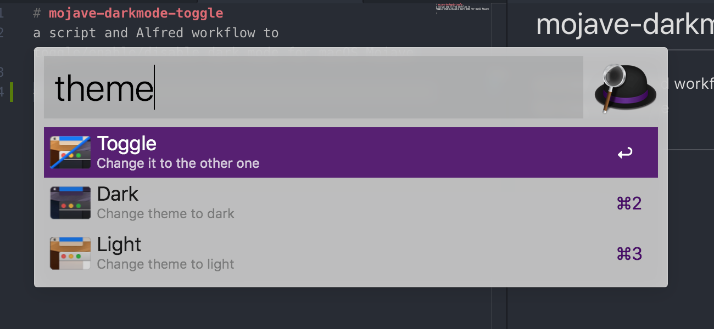

# mojave-darkmode-toggle
a script and Alfred workflow to toggle/enable/disable dark mode for macOS Mojave

[Download](https://github.com/mermaid/mojave-darkmode-toggle/blob/master/ToggleDarkMode.alfredworkflow)