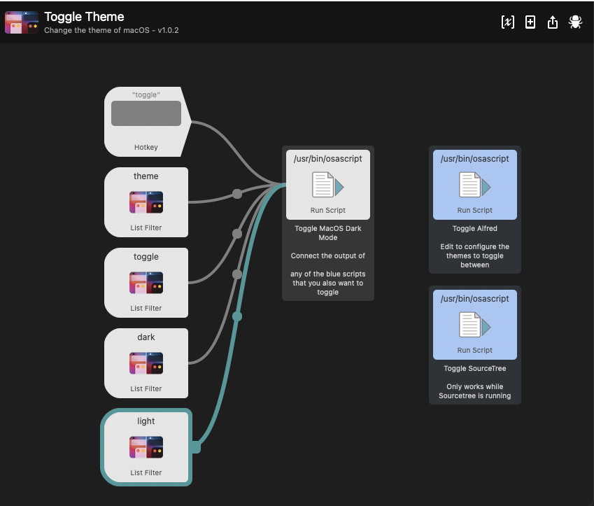

# Toggle Theme

An Alfred 4 Workflow that toggles between Light and Dark macOS Appearances.

It also has the option to toggle the theme on the following applications:
 - Alfred
 - Sourcetree

[
[
Download Workflow](https://github.com/mermaid/mojave-darkmode-toggle/raw/master/Toggle%20Theme.alfredworkflow)

The AppleScript file can be run as a standalone script to toggle or set the Appearance of macOS.
